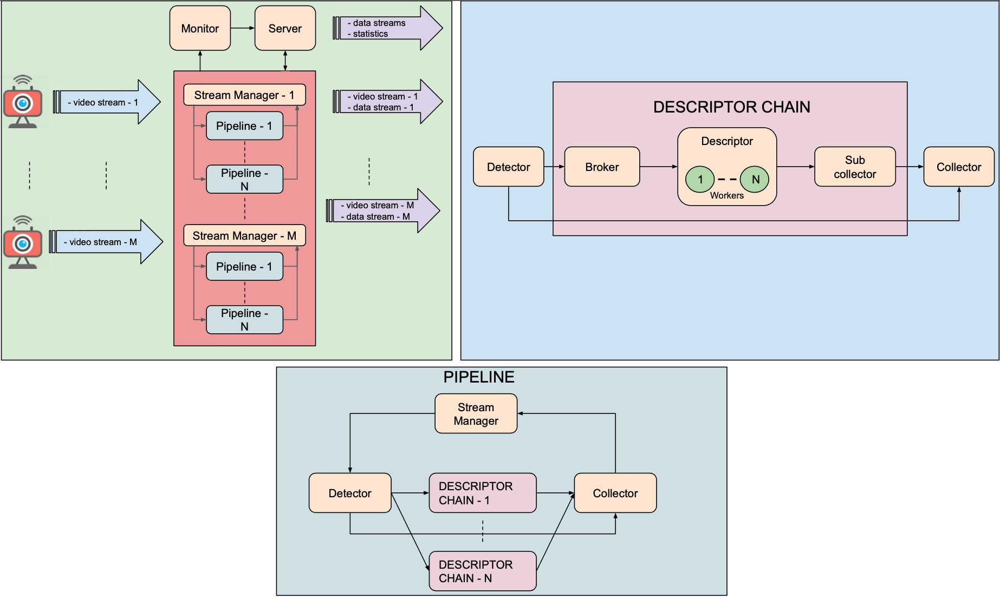

# DEEP-Framework

The DEEP-Framework is a Python-based distributed and scalable framework for analyzing a real-time video stream. At its core, the framework provides a modular Docker-based pipeline that allows to distribute and parallelize all tasks from video capturing, to object detection, to information extraction, to  results collection, to output streaming.

The current version includes an implementation of following pipelines: 
* A face detector and various algorithms that extract information from faces like:
  * Age estimation
  * Gender estimation
  * Face recognition
  * Glasses detection
  * Yaw estimation
  * Pitch estimation

* A person detector and an algorithm that extract information about clothing.

* A vehicle detector and an algorithm that performs a flux analysis of the scene.

It's possible to run multiple pipeline at the same time.
A demo web app is also included.

This work was published in the journal Sensors in the Special Issue "Applications of Video Processing and Computer Vision Sensors". The article is available in open access at this [link](https://www.mdpi.com/1424-8220/21/12/4045#).

## Features
* Can handle multiple video streams from IP cameras and webcams.
* A frame-skipping policy which ensures a real-time behavior by always processing the latest available frame
* Algorithms execution can be distributed across multiple nodes in a cluster.
* Can create multiple worker for every algorithm.
* Every algorithm can be executed in CPU and GPU modes.
* Results and performance stats available via a [Server-Sent Event (SSE)](https://en.wikipedia.org/wiki/Server-sent_events) API. 
* Can stream resulting data and input video to any web application via [WebRTC](https://en.wikipedia.org/wiki/WebRTC). It can also handle the video stream provided by a client web app via WebRTC.
* It's possibile to develop and deploy your own detector. [Instructions](docs/develop_a_detector/how_to_develop_a_detector.md).
* It's possibile to develop and deploy your own descriptor. [Instructions](docs/develop_a_descriptor/how_to_develop_a_descriptor.md).

## Architecture


The architecture of Deep Framework is composed by the following generic components:
* **Stream Manager**: establishes the connection with the video source in order to grab the individual frames and send them, together with a timestamp, to the processing components. It also gets the results from the collectors and stream video and data to any WebRTC peer.
* **Detector**: this component is responsible for extracting the coordinates of an object in an image and for tracking it along all received images. The object could be an entity that is depicted in a particular region of the image or in the entire image
* **Broker**: receives data from the Detector and distributes them across all the instances of the Descriptor.
* **Descriptor**: carries out the analysis of the ROIs and/or coordinates, retrieved by the Detector, in order to extract information about objects and/or their trajectories.
* **Sub Collector**: it aggregates the results obtained by the workers instantiated for each Descriptor.
* **Collector**: for every result coming from Detector (objects coordinates, identifiers), it produces an output message aggregating the latest available results obtained from Sub Collectors
* **Monitor**: is connected with all pipeline components and receives and aggregates from them their operating metrics
* **Server**: provides results and stats via a SSE API. It also act as a WebRTC signaling server and provides the demo web app.


## Getting Started

### Hardware requirements for a GPU node:

* CPU Intel® Core™ i7 CPU @ 2.7GHz
* GPU Nvidia with Pascal microarchitecture. Recommended feature: 3584 CUDA core, 12 GBs GPU GDDR5X e 480 GB/s (examples: TITAN X, GeForce GTX 1080 Ti);
* 16 GB RAM;

### Hardware requirements for a CPU node:

* CPU Intel® Core™ i7 CPU @ 2.7GHz
* 16 GB RAM;

### Software requirements:

Operating system: 
* Ubuntu  16.04 <= version <= 18.04
* macOS version >= 10.12 Sierra (**ONLY FOR A SINGLE NODE CLUSTER IN CPU MODE**)

Software:
* python 3.7
* pip 3
* git LFS
* nvidia-driver  >= 384.130
* Docker 18.03.1-ce
* Docker Compose 1.23.1
* nvidia-docker 2 (2.0.3+docker18.03.1-1)
* nvidia-container-runtime 2 (2.0.0+docker18.03.1-1)

These softwares must be installed on each node of the cluster.


### Installing


DEEP-Framework can be deployed on a single node cluster or in a multi node cluster. Make sure every node is accessible via SSH.
Before installation check disk space usage stats of your Docker installation. DEEP Framework required al least 60 GB of free space on your disk.

Software dependencies:
1.  Install python 3 (at least 3.7 version).
2.  Install pip3.
3.  Install [git LFS](https://github.com/git-lfs/git-lfs/wiki/Installation).
4.  Install nvidia-driver (at least 384.130 version).
5.  Install [Docker](https://docs.docker.com/install/linux/docker-ce/ubuntu/) (at least 18.03.1-ce version but lower than 19 version). 
6.  Install [Docker Compose](https://docs.docker.com/compose/install/) (at least 1.23.1 version).
7.  Install [nvidia-docker 2 and nvidia-container-runtime 2](https://github.com/nvidia/nvidia-docker/wiki/Installation-(version-2.0)) (follow instructions in order to install the proper version according to Docker's one).
8.  Clone the repository.
9.  Install software dependencies with the following command: `$ pip3 install -r requirements.txt`
10.  In order to setup Face Recognition algorithm, follow these [instructions](docs/face_recognition_docs/face_recognition.md).

DEEP-Framework can be deployed on a single node cluster or in a multi node cluster. Make sure every node is accessible via SSH.

Note that if the cluster consists of several nodes with gpu, it is necessary to run the framework on the node with a more recent version of the CUDA driver in order to correctly build the Docker images


## Running

* Starting DEEP-Framework:

DEEP-Framework starting is guided by a CLI procedure. You'll be prompted to input some information about Deep Framework infrastructure settings and video analyzing parameters. Deep Framework settings are related to the cluster configuration (ip address, user, etc. of each of node in the cluster). Video analyzing parameters are related to video source, max delay you'll accept to get your results, stats interval generation and the algorithms you'll want to execute with relative execution mode (cpu/gpu). 
You can start this procedure with the following command:
```
$ python3 main.py

```
If you want to run DEEP-Framework with the last configuration used, type the following:
```
$ python3 main.py -r
```


* Stopping DEEP-Framework:
```
$ python3 rm_services.py

```
## Usage
### 1. Using the DEEP-Framework Demo Web Application
One of the services that are included in the DEEP-Framework once it's up and running is a demo application that allows to visualize and manage the video stream, the resulting data stream, and the performance of the DEEP-Framework services and algorithms from any web browser. This web app can be accessed at `https://<IP_ADDRESS_OF_THE_MAIN_NODE>:8000` and provides three main views:
* **CONTROLS**: Here are the controls for establishing the WebRTC peer connection with the Server, selecting the Stream Manager to peer with, and selecting and starting the video stream. The source of the video stream can be either a IP camera (the camera URL has to be previously defined during the guided CLI starting procedure) or the webcam of the client device. 
* **DASHBOARD**: This is the panel for monitoring the state and performance of the DEEP-Framework services and algorithms. 
* **VIEWER**: Provides the a user friendly interface for visualizing the video stream and the resulting data. Some results like the face detection boxes, and the yaw and pitch angles are graphically represented as an overlay of the video stream.
* * **API DOCS**: Provides the API documentation for the specific configuration set by the user.

### 2. Using a custom web application
You can interact directly with the Server and the Stream Manager from your browser-based application by using the [hyperpeer-js module](https://github.com/crs4/hyperpeer-js) (DEEP-Framework video streaming is based on [Hyperpeer](http://www.crs4.it/results/technology-catalogue/hyperpeer/) which in turn is based on [WebRTC](https://en.wikipedia.org/wiki/WebRTC)). You can install this javascript library (currently available only through its GitHub repo) and using it in your code using browserify or any other frontend package manager. [Here](docs/custom_app_example.js) you can find a simplified example that illustrates how to use [hyperpeer-js](https://github.com/crs4/hyperpeer-js) for sending the local webcam video stream and get the results as `data` events. See [hyperpeer-js](https://github.com/crs4/hyperpeer-js) documentation for more details. 

### 3. Using the SSE API
The web app (either the demo or a custom one) is the main interface for controlling and monitoring the analysis of a video stream with the DEEP-Framework. However, it connects to the Stream Manager with a peer-to-peer connection so only one client application can be used at a time. If you need to send the video analysis results to another or many other applications you can use the SSE API which provides multiple endpoints (consider that analysis has been started through the web app first in order to receive any data):
* `/api/stream_<DETECTOR_CATEGORY>`: there is an endpoint for every detector chosen.
* `/api/stats`: it shows functioning statistics about the components running in the pipelines.
* `/api/algs`: it shows running alghorithms.


## License

This project is licensed under the GPL3 License - see the [LICENSE](LICENSE) file for details

