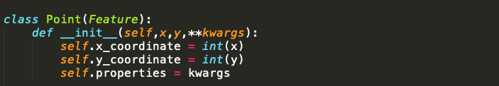
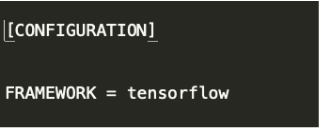

## How to develop a detector

An algorithm of object detection can be developed with following operations:
1. Create a folder inside the path . 
2. Create the class that implements the detector and tracker in separate files.
3. Create the executor.py file.
4. Create the configuration file 'configuration.ini'.
5 .Create the Dockerfiles according.
6. Execute the test creation and execution procedure.

These operation will be described in following sections.

### Executor creation

The executor implements the object detection and tracking algorithm on multiple sequential frames. The operations to be performed within the file are:
* Import the classes that perform detection and tracking.
* Define a class that extends the AbstractDetector abstract class, defined at the path .
* Implement the extract_features method within the class. This method is invoked in the main interface, which manages all the installed detection algorithms, and cyclically receives the frames, which are the input stream to the DeepFramework, and a dictionary (executor_dict) that contains all the information needed to implement your own detection and and tracking algorithm. In short:


The executor_dict dictionary contains the following keys:
* **frame_idx**: frame id received from the detector
* **vc_time**: instant of time when the image is captured
* **frame_shape**: frame size
* **frame_counter**: counter of analysed frames

The method must return a list of Object type objects. The Object class is implemented at the following path: (utils/features.py). It presents the following interface:


The input parameters are:
* **rect**: is an object of type Rect 
* **points**: is a list of objects of type Point
* **pid**: is the object's identifier. It can be set manually or it can be assigned automatically. It is set to None if whole_image is set to True and the pid field is not initialised.
* **whole_image**: when set to True, indicates that the object is made up of the whole image
The coordinates of the bounding boxes and/or keypoints must initialize Rect and Point objects respectively. The classes have the following interfaces.




Example of function implementation:


### Creation of dockerfiles
The following guidelines must be taken into account when creating dockerfiles:
* The Dockerfile for creating Docker images that will only use the cpu should be called Dockerfile.cpu
* The Dockerfile for creating Docker images that will use the gpu should be called Dockerfile.gpu
* Supporting Docker images should be named Dockerfile.setup if any.
Modify the Dockerfiles according to the comments in the sample dockerfiles within the ![alt text]sample_detector/ folder.

### Creating configuration files
Create a configuration file with the '.ini' extension in your detector folder. The file must contain the following information
* **CATEGORY**: indicates the type of object detected by the detector. It also constitutes the name associated with the detector
* **PATH**: path of the file containing the Executor class, relative to the object_extractors folder
* **CLASS**: Executor's class name
* **FRAMEWORK**: the framework used by the detector in case of GPU use (None if no framework is used)

Example:
* Case 1: The detector uses a framework but only in CPU mode or does not use any framework.


Case 2: The detector uses a framework (e.g. tensorflow) in GPU mode.



Example of a configuration file:


### Creation and execution of tests
Once the detector development and configuration procedure has been completed, the test procedure must be carried out.
Execute the following command:
```
python3 test_creator.py
```

This command generates the scripts to test all the algorithms (detection and feature extraction) installed on the platform. For detection algorithms, the tests are created in the following path:
![alt text]detector/detector_tests/test_scripts
To run a test, from the main folder, run the desired script. Example:
```
./detector/detector_tests/test_scripts/my_test.sh
```

Before executing the script, it is necessary to insert an image, called test_image.jpg, inside the detector folder, which will be used to verify the correct functioning of the algorithm developed.


