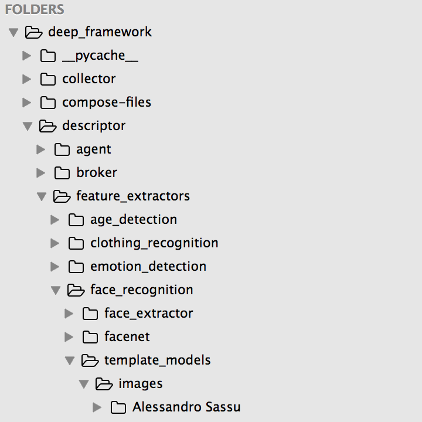
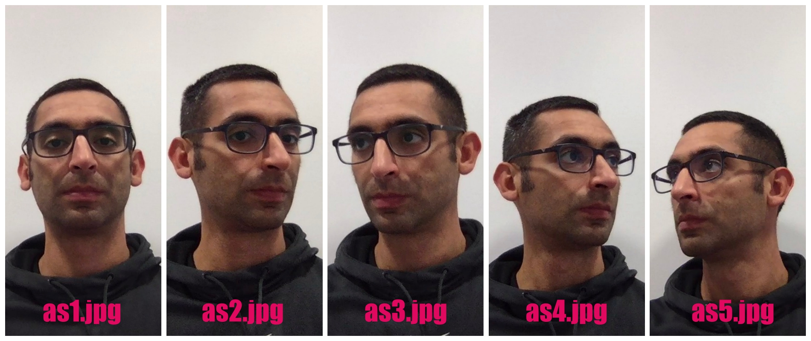

### Face Recognition Setup

```
1.  cd descriptor/feature_extractors/face_recognition/
```
```
2.  mkdir template_models/images/	
```
3.  In folder `images` create subfolders named as people you want to recognize (Ex. 'Alessandro Sassu').

4.  In each subfolder, you have to save good images of the relative person (at least 5 good quality images in different poses).

## Working tree


## Sample images Alessandro Sassu

